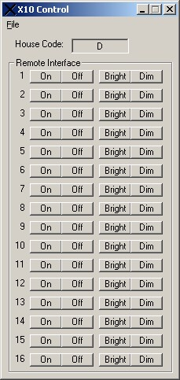



## X10 Control

### Description

This program controls X10 units. X10 units are modules that plug into the wall and lets you plug in lamps and other appliances. The cool thing about it is that you can use a remote to control them. Also, you can use your computer, which is what I do. I made this program to schedule certin events, like if you want to program it to turn lights on and off if you want to make it look like you're home or something. If you want to know more about X10 controls, go to www.x10.com. This program requires an X10 Computer Interface.
 
### More Info
 
This program uses tray functions and it controls X10 units. I designed this program after I saw another program like this on PSC.

             |
---                |---
**Submitted On**   |2002-12-31 11:25:34
**By**             |[Andy Wells](https://github.com/Planet-Source-Code/PSCIndex/blob/master/ByAuthor/andy-wells.md)
**Level**          |Intermediate
**User Rating**    |4.6 (23 globes from 5 users)
**Compatibility**  |VB 6\.0
**Category**       |[Complete Applications](https://github.com/Planet-Source-Code/PSCIndex/blob/master/ByCategory/complete-applications__1-27.md)
**World**          |[Visual Basic](https://github.com/Planet-Source-Code/PSCIndex/blob/master/ByWorld/visual-basic.md)
**Archive File**   |[X10\_Contro15210412312002\.zip](https://github.com/Planet-Source-Code/andy-wells-x10-control__1-42031/archive/master.zip)

